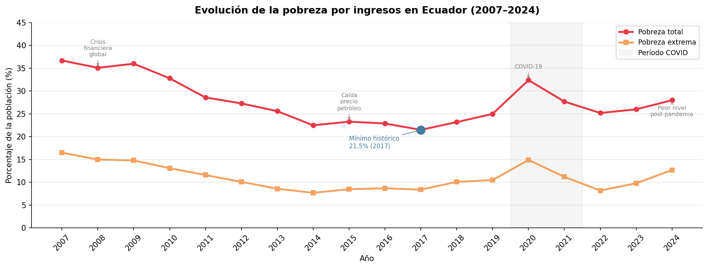
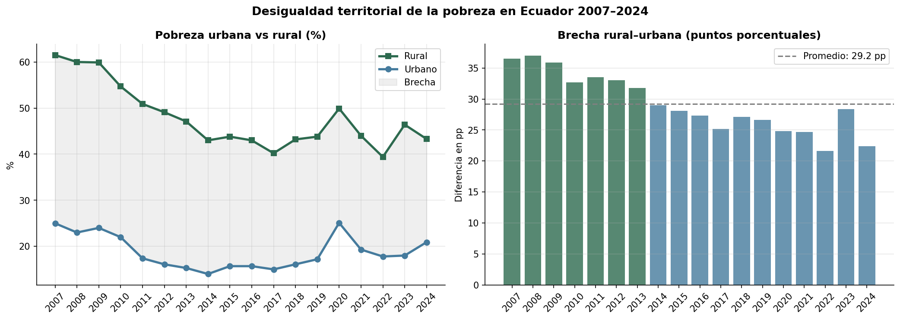
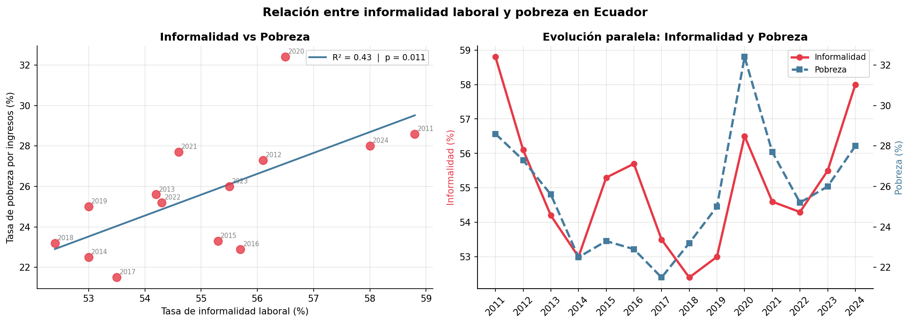
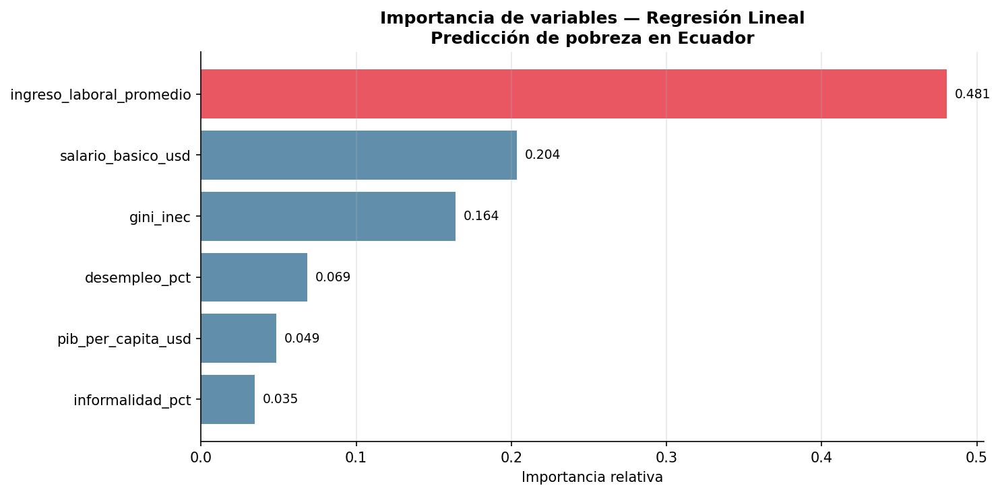
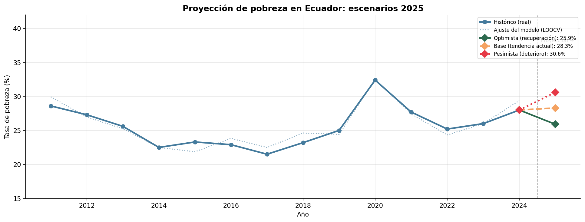

# 🇪🇨 Mercado Laboral y Pobreza en Ecuador 2007–2024

[](https://python.org)
[](https://powerbi.microsoft.com)
[](LICENSE)

Análisis integral del mercado laboral y la pobreza en Ecuador utilizando datos
oficiales del INEC (ENEMDU), el Banco Mundial y el Banco Central del Ecuador.
El proyecto combina análisis exploratorio de datos, visualización interactiva
y un modelo de Machine Learning que predice la tasa de pobreza con un error
promedio de **0.72 puntos porcentuales**.

---

## 📌 Hallazgos principales

| # | Hallazgo |
|---|---|
| 1 | Ecuador redujo su pobreza **15.2 pp** entre 2007 y 2017, pero el COVID-19 revirtió **10.9 pp** en un solo año |
| 2 | La brecha rural-urbana promedió **29.2 pp** en todo el período — en 2024: 43.3% rural vs 20.9% urbana |
| 3 | La informalidad laboral alcanzó el **58.0% en 2024**, su nivel más alto desde 2007 |
| 4 | El ingreso laboral es el predictor más importante de pobreza (importancia: **0.481**) |
| 5 | El modelo proyecta una pobreza de **28.3% para 2025** en el escenario base |

---

## ❓ Preguntas de investigación

1. ¿Cómo ha evolucionado la tasa de pobreza por ingresos en Ecuador entre 2007 y 2024?
2. ¿Qué tan grande es la brecha de pobreza entre zonas urbanas y rurales?
3. ¿Qué relación existe entre la informalidad laboral y los niveles de pobreza?
4. ¿Cómo se relacionan el crecimiento del PIB y la reducción de la pobreza?
5. ¿Qué variables laborales y económicas predicen mejor la tasa de pobreza?

---

## 📁 Estructura del proyecto

├── data/
│   ├── processed/      # Datasets limpios listos para análisis
│   └── external/       # Datos complementarios
├── notebooks/          # Análisis en Jupyter / Google Colab
├── dashboard/          # Dashboard interactivo en Power BI
├── report/             # Informe final en PDF
├── images/             # Visualizaciones generadas
└── requirements.txt    # Dependencias del proyecto

---

## 🗺️ Pipeline del proyecto

Datos INEC-ENEMDU ──┐
Banco Mundial ───────┼──► Limpieza y EDA ──► Dashboard Power BI
BCE ─────────────────┘         │
└──► Modelo ML ──► Proyecciones 2025

---

## 📊 Visualizaciones

### Evolución de la pobreza 2007–2024


### Brecha territorial urbano-rural


### Informalidad vs Pobreza


### Importancia de variables del modelo


### Proyección de pobreza 2025


---

## 🤖 Modelo predictivo

| Métrica | Valor |
|---|---|
| Modelo | Regresión Lineal |
| Validación | Leave-One-Out Cross Validation |
| R² | 0.903 |
| MAE | 0.72 pp |
| RMSE | 0.72 pp |
| Observaciones | 14 años (2011–2024) |

### Variables predictoras

| Variable | Importancia | Categoría |
|---|---|---|
| Ingreso laboral promedio | 0.481 | Ingresos |
| Salario básico unificado | 0.204 | Política salarial |
| Coeficiente Gini | 0.164 | Desigualdad |
| Tasa de desempleo | 0.069 | Mercado laboral |
| PIB per cápita | 0.049 | Economía |
| Tasa de informalidad | 0.035 | Mercado laboral |

---

## 🛠️ Herramientas y tecnologías

- **Lenguaje:** Python 3.10
- **Análisis de datos:** pandas, numpy, scipy
- **Visualización:** matplotlib, seaborn
- **Machine Learning:** scikit-learn
- **Dashboard:** Power BI Desktop
- **Informe:** ReportLab
- **Entorno:** Google Colab

---

## 📦 Instalación y uso

```bash
# Clonar el repositorio
git clone https://github.com/TU-USUARIO/ecuador-empleo-pobreza-analysis.git
cd ecuador-empleo-pobreza-analysis

# Instalar dependencias
pip install -r requirements.txt

# Ejecutar notebooks en orden
# 01 → 02 → 03 → 04 → 05
```

---

## 📋 Fuentes de datos

| Fuente | Indicadores | Acceso |
|---|---|---|
| INEC – ENEMDU | Pobreza, empleo, informalidad, Gini | [ecuadorencifras.gob.ec](https://ecuadorencifras.gob.ec) |
| Banco Mundial | PIB, crecimiento económico | [datos.bancomundial.org](https://datos.bancomundial.org) |
| BCE | Salario básico histórico | [estadisticas.bce.fin.ec](https://estadisticas.bce.fin.ec) |

---

## 👤 Autor

**Bryan Anthony López Guerrero**

[](https://linkedin.com/in/TU-PERFIL)
[](https://github.com/TU-USUARIO)

Ingeniero en Tecnologías de la Información | Máster en Visual Analytics y Big Data |
Especialista en Big Data e Inteligencia Artificial

---

## 📄 Licencia

Este proyecto está bajo la Licencia MIT. Ver [LICENSE](LICENSE) para más detalles.
